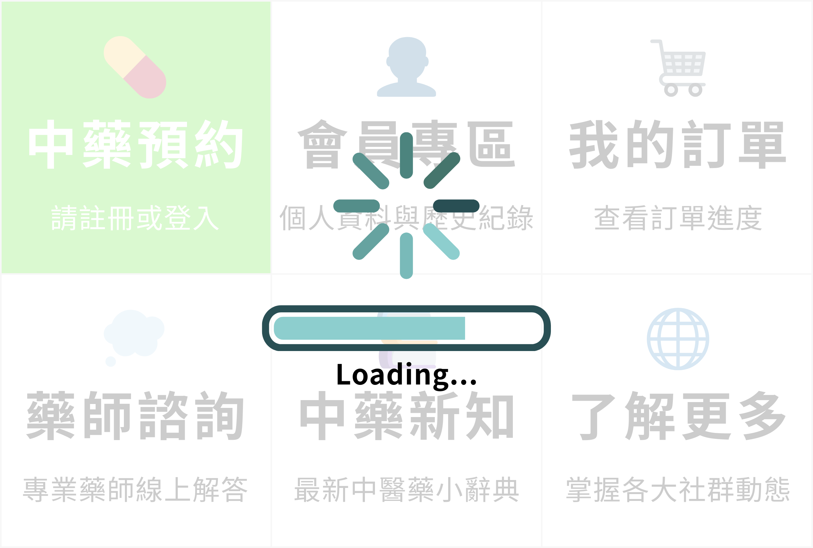

# LINE Bot 圖文選單 (Rich Menu) 設定完整指南

## 📋 目錄
- [系統概述](#系統概述)
- [圖文選單架構](#圖文選單架構)
- [前置準備](#前置準備)
- [設定步驟](#設定步驟)
- [圖片製作規範](#圖片製作規範)
- [選單配置說明](#選單配置說明)
- [疑難排解](#疑難排解)
- [進階管理](#進階管理)

---

## 🎯 系統概述

TSCP LINE Bot 使用三種圖文選單來提供不同的使用者體驗：

| 選單類型 | 用途 | 顯示時機 |
|---------|------|---------|
| **訪客選單** | 未登入用戶使用 | 用戶首次加入 Bot 或登出後 |
| **會員選單** | 已登入會員使用 | 用戶登入成功後 |
| **Loading 選單** | 處理中狀態顯示 | 執行耗時操作時（查詢訂單、載入資料等） |

### 系統特色
✅ **自動切換** - 根據登入狀態自動切換選單  
✅ **Loading 回饋** - 處理請求時顯示處理中狀態  
✅ **減少 API 調用** - 使用 Rich Menu 切換代替 pushMessage  
✅ **良好 UX** - 提供即時視覺回饋

---

## 🏗️ 圖文選單架構

### 1. 訪客選單 (Guest Rich Menu)


**功能說明：**
- **上方區域**：中藥預約（點擊後提示需要登入）
- **左下區域**：藥師諮詢（開放功能，可直接使用）
- **中下區域**：中藥新知（衛教資訊）
- **右下區域**：了解更多（使用教學）

---

### 2. 會員選單 (Member Rich Menu)


**功能說明：**
- **左上區域**：新增訂單（建立新的中藥預約）
- **中上區域**：會員中心（個人資料、登出等）
- **右上區域**：我的訂單（查看訂單列表）
- **下方三區域**：與訪客選單相同

---

### 3. Loading 選單 (Loading Rich Menu)



**功能說明：**
- 整個區域顯示處理中訊息
- 點擊時顯示「Loading ...」
- 處理完成後自動切換回原選單

---

## 📋 前置準備

### 1. 確認環境設定

確認 `.env` 檔案中有以下設定：

```env
LINE_CHANNEL_ACCESS_TOKEN=your_channel_access_token
LINE_CHANNEL_SECRET=your_channel_secret
```

### 2. 準備圖片檔案

在 `public/` 資料夾中準備以下圖片：

```
public/
├── guest_richmenu.png      # 訪客選單圖片 (2500x1686)
├── member_richmenu.png     # 會員選單圖片 (2500x1686)
└── loading_richmenu.png    # Loading 選單圖片 (2500x1686)
```

**⚠️ 圖片規範：**
- **尺寸**：必須是 `2500 x 1686` 像素
- **格式**：支援 PNG 或 JPG
- **檔案大小**：建議小於 1MB
- **設計建議**：清晰的區域劃分、易於理解的圖示

### 3. 安裝相依套件

確認已安裝所需的 npm 套件：

```bash
npm install
```

---

## 🚀 設定步驟

### 方法一：快速自動設定（推薦）

這是最簡單的方法，一次建立所有圖文選單。

#### 步驟 1：執行設定腳本

```bash
npm run setup-menus
```

或

```bash
node scripts/setup-rich-menus.js
```

#### 步驟 2：查看輸出結果

腳本執行完成後會顯示：

```
🎉 圖文選單建立完成！

📝 請將以下內容加入你的 .env 檔案:
==================================================
GUEST_RICH_MENU_ID=richmenu-abc123...
MEMBER_RICH_MENU_ID=richmenu-def456...
LOADING_RICH_MENU_ID=richmenu-ghi789...
==================================================

✅ 完成！現在你可以重新啟動應用程式來使用新的圖文選單。
```

#### 步驟 3：更新 .env 檔案

將輸出的 Rich Menu ID 加入 `.env` 檔案：

```env
# LINE Bot 設定
LINE_CHANNEL_ACCESS_TOKEN=your_token_here
LINE_CHANNEL_SECRET=your_secret_here

# Rich Menu IDs
GUEST_RICH_MENU_ID=richmenu-abc123...
MEMBER_RICH_MENU_ID=richmenu-def456...
LOADING_RICH_MENU_ID=richmenu-ghi789...
```

#### 步驟 4：重新啟動應用程式

```bash
# 本地開發
npm run dev

# 生產環境
npm start
```

#### 步驟 5：測試功能

1. 在 LINE 中打開你的 Bot
2. 確認看到圖文選單（下方功能欄）
3. 點擊各個按鈕測試功能
4. 嘗試登入/登出，確認選單會切換

---

### 方法二：互動式管理（進階）

使用互動式工具可以更靈活地管理圖文選單。

#### 啟動管理工具

```bash
npm run manage-menus
```

或

```bash
node scripts/manage-rich-menus.js
```

#### 管理選單操作

```
🎨 LINE Bot 圖文選單管理工具

請選擇操作：
1. 列出現有圖文選單
2. 建立新的圖文選單
3. 刪除指定圖文選單
4. 建立完整的選單組合（訪客+會員+Loading）
5. 退出

請輸入選項 (1-5):
```

**功能說明：**

| 選項 | 功能 | 使用時機 |
|------|------|---------|
| **1** | 列出現有選單 | 查看目前已建立的所有圖文選單 |
| **2** | 建立新選單 | 單獨建立訪客、會員或 Loading 選單 |
| **3** | 刪除選單 | 清理不需要的舊選單 |
| **4** | 建立完整組合 | 一次建立所有三種選單 |
| **5** | 退出程式 | 結束管理工具 |

#### 範例：建立完整選單組合

```bash
$ npm run manage-menus

請選擇操作：
> 4

🎨 建立完整的選單組合...

🎨 建立訪客圖文選單...
✅ 訪客圖文選單建立成功，ID: richmenu-abc...
✅ 訪客圖文選單圖片上傳成功

🎨 建立會員圖文選單...
✅ 會員圖文選單建立成功，ID: richmenu-def...
✅ 會員圖文選單圖片上傳成功

🎨 建立 Loading 狀態圖文選單...
✅ Loading 圖文選單建立成功，ID: richmenu-ghi...
✅ Loading 圖文選單圖片上傳成功

🎉 完整選單組合建立成功！

📝 請將以下內容加入 .env 檔案:
==================================================
GUEST_RICH_MENU_ID=richmenu-abc...
MEMBER_RICH_MENU_ID=richmenu-def...
LOADING_RICH_MENU_ID=richmenu-ghi...
==================================================

是否要自動寫入 .env 檔案？ (y/N): y
✅ .env 檔案更新成功！
```

---

### 方法三：單獨建立 Loading 選單

如果只需要建立或更新 Loading 選單：

```bash
node scripts/setup-loading-menu.js
```

---

## 🎨 圖片製作規範

### 尺寸要求

**所有圖文選單圖片必須是 `2500 x 1686` 像素**

### 區域座標計算

圖文選單的可點擊區域使用座標定義：

```javascript
{
  bounds: { 
    x: 起始X座標, 
    y: 起始Y座標, 
    width: 寬度, 
    height: 高度 
  }
}
```

#### 訪客選單區域配置

```
上方區域（中藥預約）：
  x: 0, y: 0, width: 2500, height: 843

左下區域（藥師諮詢）：
  x: 0, y: 843, width: 833, height: 843

中下區域（中藥新知）：
  x: 833, y: 843, width: 834, height: 843

右下區域（了解更多）：
  x: 1667, y: 843, width: 833, height: 843
```

#### 會員選單區域配置

```
左上區域（新增訂單）：
  x: 0, y: 0, width: 833, height: 562

中上區域（會員中心）：
  x: 834, y: 0, width: 834, height: 562

右上區域（我的訂單）：
  x: 1667, y: 0, width: 833, height: 562

下方三個區域與訪客選單相同
```

### 設計建議

1. **視覺清晰度**
   - 使用對比色區分不同區域
   - 圖示大小適中，易於辨識
   - 文字清晰可讀（建議字體大小 > 40px）

2. **品牌一致性**
   - 使用統一的顏色配置
   - 保持圖示風格一致
   - 與 LINE Bot 主題配合

3. **可點擊提示**
   - 明確標示可點擊區域
   - 使用按鈕樣式設計
   - 避免過度複雜的圖案

4. **Loading 選單特殊考量**
   - 使用動畫效果圖示（如旋轉圈）
   - 簡潔明瞭的「處理中」訊息
   - 柔和的背景色，避免刺眼

### 推薦工具

- **Figma** - 免費線上設計工具
- **Canva** - 簡易圖片編輯
- **Adobe Photoshop** - 專業圖片編輯
- **LINE Rich Menu Generator** - LINE 官方設計工具

---

## ⚙️ 選單配置說明

### 訪客選單程式碼說明

```javascript
const richMenu = {
  size: {
    width: 2500,
    height: 1686
  },
  selected: true,              // 是否預設選中
  name: '訪客選單',            // 選單名稱（後台顯示）
  chatBarText: '功能選單',     // 聊天欄顯示文字
  areas: [
    // 訂單管理 - 需要登入
    {
      bounds: { x: 0, y: 0, width: 2500, height: 843 },
      action: {
        type: 'postback',
        data: `action=login_required&feature=orders&message=${encodeURIComponent('🔒 訂單功能需要先登入會員帳號')}`
      }
    },
    // 藥師諮詢
    {
      bounds: { x: 0, y: 843, width: 833, height: 843 },
      action: {
        type: 'postback',
        data: 'action=pharmacist_consultation'
      }
    },
    // ... 其他區域
  ]
};
```

### Postback Action 說明

每個可點擊區域都會觸發 Postback 事件：

| Action | 說明 | 處理位置 |
|--------|------|---------|
| `action=login_required` | 提示需要登入 | `postbackHandler.ts` |
| `action=pharmacist_consultation` | 藥師諮詢 | `postbackHandler.ts` |
| `action=herbal_news` | 中藥新知 | `postbackHandler.ts` |
| `action=tutorial` | 使用教學 | `postbackHandler.ts` |
| `action=create_order` | 新增訂單 | `orderHandler.ts` |
| `action=view_orders` | 查看訂單 | `orderHandler.ts` |
| `action=member_center` | 會員中心 | `postbackHandler.ts` |

### 選單切換邏輯

圖文選單會在以下情況自動切換：

```javascript
// 登入成功 → 切換到會員選單
await client.linkRichMenuToUser(userId, MEMBER_RICH_MENU_ID);

// 登出 → 切換到訪客選單
await client.linkRichMenuToUser(userId, GUEST_RICH_MENU_ID);

// 執行耗時操作 → 切換到 Loading 選單
await client.linkRichMenuToUser(userId, LOADING_RICH_MENU_ID);

// 操作完成 → 恢復到原選單
const isLoggedIn = await checkUserLoginStatus(userId);
const menuId = isLoggedIn ? MEMBER_RICH_MENU_ID : GUEST_RICH_MENU_ID;
await client.linkRichMenuToUser(userId, menuId);
```

---

## 🔧 疑難排解

### 問題 1：403 Forbidden 錯誤

**錯誤訊息：**
```
❌ 建立訪客圖文選單失敗: Error: 403 Forbidden
```

**可能原因：**
- LINE Channel Access Token 不正確
- Bot 沒有建立圖文選單的權限

**解決方法：**
1. 檢查 `.env` 檔案中的 `LINE_CHANNEL_ACCESS_TOKEN`
2. 前往 [LINE Developers Console](https://developers.line.biz/)
3. 確認 Token 是否正確
4. 重新發行 Token 並更新 `.env`

```bash
# 重新設定環境變數
cp .env.example .env
# 編輯 .env，填入正確的 Token
```

---

### 問題 2：400 Bad Request - 圖片相關錯誤

**錯誤訊息：**
```
❌ 建立訪客圖文選單失敗: Error: 400 Bad Request
```

**可能原因：**
- 圖片檔案不存在
- 圖片尺寸不正確（必須是 2500x1686）
- 圖片格式不支援

**解決方法：**

1. **檢查圖片是否存在：**
```bash
ls -lh public/*.png
```

2. **檢查圖片尺寸：**
```bash
# macOS
sips -g pixelWidth -g pixelHeight public/guest_richmenu.png

# 應該顯示：
# pixelWidth: 2500
# pixelHeight: 1686
```

3. **調整圖片尺寸：**
```bash
# 使用 ImageMagick（需先安裝）
convert input.png -resize 2500x1686! public/guest_richmenu.png
```

---

### 問題 3：圖片檔案不存在警告

**警告訊息：**
```
⚠️  訪客圖文選單圖片檔案不存在: /path/to/public/guest_richmenu.png
```

**解決方法：**

1. **確認檔案位置：**
```bash
# 檢查 public 資料夾
ls -la public/

# 應該有這些檔案：
# guest_richmenu.png
# member_richmenu.png
# loading_richmenu.png
```

2. **下載範例圖片：**
如果沒有圖片，可以先建立簡單的測試圖片：

```bash
# 使用 ImageMagick 建立測試圖片
convert -size 2500x1686 xc:lightblue \
  -pointsize 100 -gravity center \
  -annotate +0+0 '訪客選單' \
  public/guest_richmenu.png

convert -size 2500x1686 xc:lightgreen \
  -pointsize 100 -gravity center \
  -annotate +0+0 '會員選單' \
  public/member_richmenu.png

convert -size 2500x1686 xc:lightyellow \
  -pointsize 100 -gravity center \
  -annotate +0+0 'Loading...' \
  public/loading_richmenu.png
```

---

### 問題 4：選單沒有自動切換

**症狀：**
- 登入後選單沒有變更
- Loading 選單沒有顯示

**檢查步驟：**

1. **確認環境變數已設定：**
```bash
# 檢查 .env 檔案
cat .env | grep RICH_MENU
```

應該看到：
```
GUEST_RICH_MENU_ID=richmenu-xxx...
MEMBER_RICH_MENU_ID=richmenu-yyy...
LOADING_RICH_MENU_ID=richmenu-zzz...
```

2. **重新啟動應用程式：**
```bash
# 停止現有程序
# 重新啟動
npm run dev
```

3. **檢查程式碼中的選單切換邏輯：**

查看 `src/handlers/richMenuHandler.ts`：

```typescript
export async function switchToMemberMenu(userId: string) {
  const menuId = process.env.MEMBER_RICH_MENU_ID;
  if (!menuId) {
    console.error('MEMBER_RICH_MENU_ID not set in environment');
    return;
  }
  await client.linkRichMenuToUser(userId, menuId);
}
```

---

### 問題 5：已經有舊的圖文選單

**症狀：**
```
📋 現有的圖文選單:
1. ID: richmenu-old123...
   名稱: 舊選單
   ...
```

**解決方法：**

**選項 A：保留舊選單，使用新選單**
```bash
# 直接建立新選單（不影響舊的）
npm run setup-menus

# 更新 .env 使用新的 ID
```

**選項 B：刪除舊選單**
```bash
# 使用互動式工具
npm run manage-menus

# 選擇：3. 刪除指定圖文選單
# 輸入舊選單的 ID

# 然後建立新選單
# 選擇：4. 建立完整的選單組合
```

**選項 C：使用指令碼批次清理**
```bash
# 使用清理腳本
node scripts/cleanup-rich-menus.js
```

---

### 問題 6：LINE API 限制錯誤

**錯誤訊息：**
```
❌ Error: 429 Too Many Requests
```

**原因：**
LINE API 有速率限制

**解決方法：**
1. 等待幾分鐘後再試
2. 避免短時間內頻繁建立/刪除選單
3. 使用 Loading Rich Menu 減少 pushMessage 調用

---

## 🎓 進階管理

### 列出所有圖文選單

```bash
npm run manage-menus
# 選擇選項 1
```

或直接使用程式碼：

```javascript
const { Client } = require('@line/bot-sdk');

const client = new Client({
  channelAccessToken: process.env.LINE_CHANNEL_ACCESS_TOKEN
});

const richMenus = await client.getRichMenuList();
console.log(richMenus);
```

---

### 取得特定用戶的圖文選單

```javascript
const richMenuId = await client.getRichMenuIdOfUser(userId);
console.log('用戶當前使用的圖文選單 ID:', richMenuId);
```

---

### 手動切換用戶的圖文選單

```javascript
// 切換到會員選單
await client.linkRichMenuToUser(userId, process.env.MEMBER_RICH_MENU_ID);

// 切換到訪客選單
await client.linkRichMenuToUser(userId, process.env.GUEST_RICH_MENU_ID);

// 取消圖文選單連結
await client.unlinkRichMenuFromUser(userId);
```

---

### 批次設定預設圖文選單

如果想讓所有新用戶預設使用訪客選單：

```javascript
// 設定預設圖文選單（所有新用戶會自動使用）
await client.setDefaultRichMenu(process.env.GUEST_RICH_MENU_ID);

// 取消預設圖文選單
await client.cancelDefaultRichMenu();
```

**注意：** 通常我們在 `followHandler.ts` 中處理新用戶，手動設定訪客選單，而不是使用預設選單功能。

---

### 更新圖文選單圖片

如果要更新圖片但保留選單設定：

```bash
# 1. 準備新圖片（放在 public/ 資料夾）
# 2. 執行更新腳本

node scripts/refresh-rich-menus.js
```

或手動更新：

```javascript
const fs = require('fs');
const path = require('path');

const imageBuffer = fs.readFileSync('public/new_guest_richmenu.png');
await client.setRichMenuImage(
  process.env.GUEST_RICH_MENU_ID,
  imageBuffer,
  'image/png'
);
```

---

### 監控圖文選單使用狀況

建議定期檢查圖文選單的使用狀況：

```javascript
// 在 webhook handler 中加入 logging
console.log('Postback Event:', {
  userId,
  data: event.postback.data,
  richMenuId: await client.getRichMenuIdOfUser(userId)
});
```

---

## 📚 相關文件

- [LINE Messaging API - Rich Menu 官方文件](https://developers.line.biz/en/docs/messaging-api/using-rich-menus/)
- [DEVELOPMENT.md](./DEVELOPMENT.md) - 本地開發指南
- [README-loading-menu.md](./README-loading-menu.md) - Loading 選單詳細說明
- [scripts/README.md](../scripts/README.md) - 腳本工具說明

---

## ✅ 檢查清單

設定完成後，請確認以下項目：

- [ ] `.env` 檔案中有 `GUEST_RICH_MENU_ID`
- [ ] `.env` 檔案中有 `MEMBER_RICH_MENU_ID`
- [ ] `.env` 檔案中有 `LOADING_RICH_MENU_ID`
- [ ] 圖片檔案都已上傳到 LINE
- [ ] 應用程式已重新啟動
- [ ] 在 LINE 中可以看到圖文選單
- [ ] 點擊訪客選單的各個按鈕都有反應
- [ ] 登入後選單會切換到會員選單
- [ ] 登出後選單會切換回訪客選單
- [ ] 執行耗時操作時會顯示 Loading 選單
- [ ] Loading 完成後會自動恢復正常選單

---

## 🎉 完成！

恭喜！你已經完成 LINE Bot 圖文選單的設定。

**下一步：**
- 測試所有功能按鈕
- 根據需求調整選單配置
- 設計更精美的圖文選單圖片
- 參考 [DEVELOPMENT.md](./DEVELOPMENT.md) 繼續開發其他功能

**需要協助？**
- 查看 [疑難排解](#疑難排解) 章節
- 檢查 LINE Developers Console 的錯誤日誌
- 參考 LINE 官方文件
